# Backend_Assignment

##Created Cluster
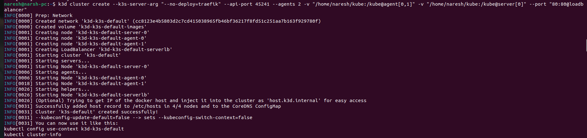

## Running Kubernetes Control panel and list of cluster and nodes
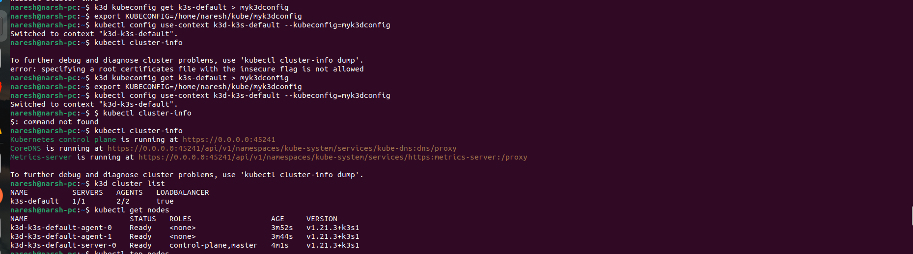
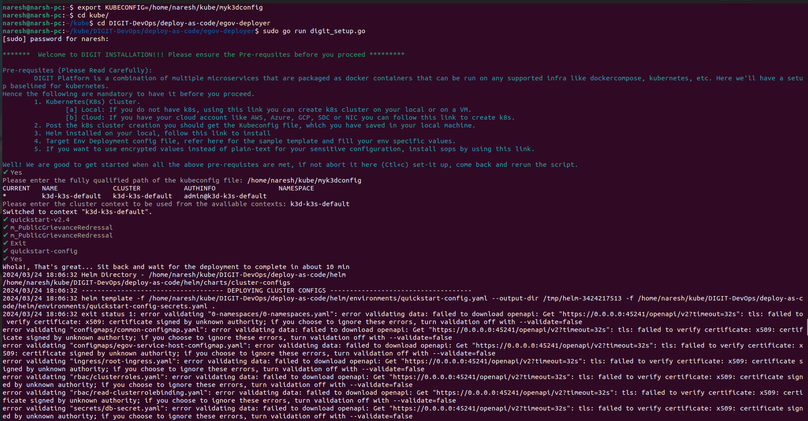

## Running Setup file
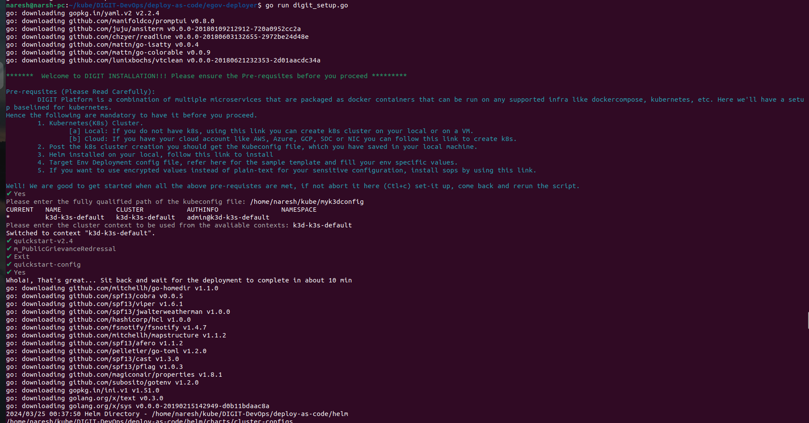

## Deployment Started
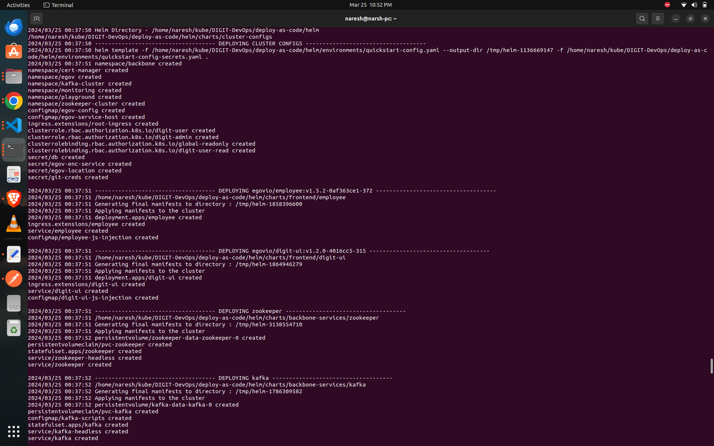

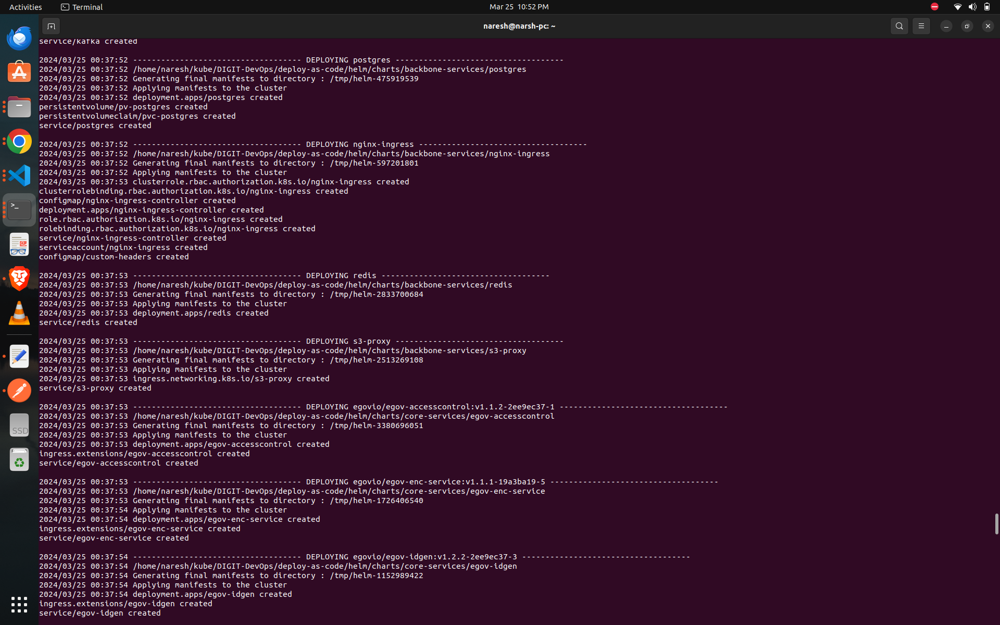
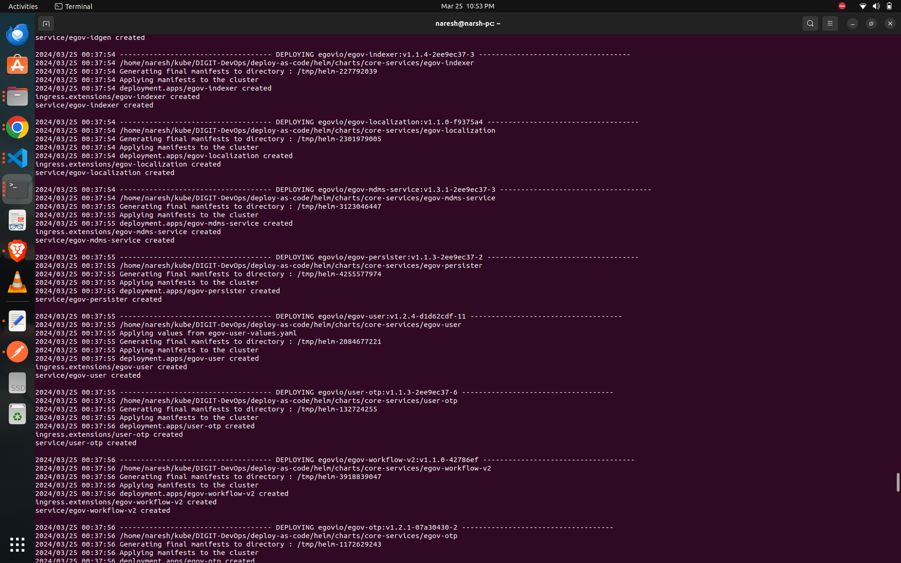
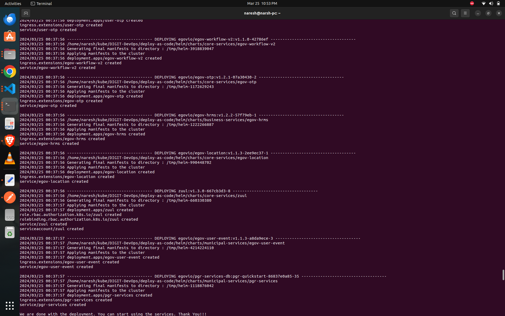
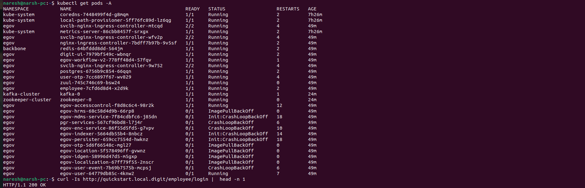

## Port forwarding
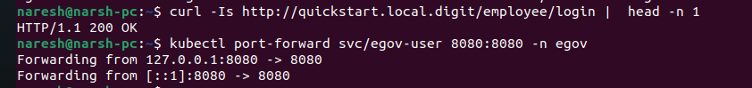

## Running on local Host
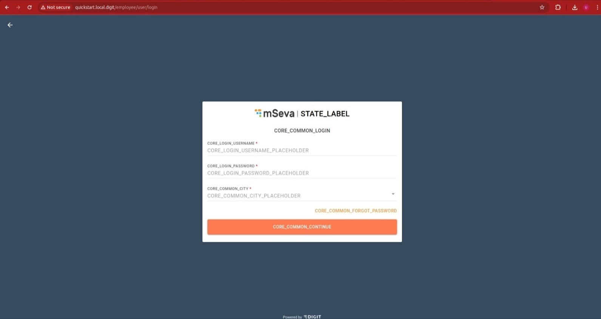
